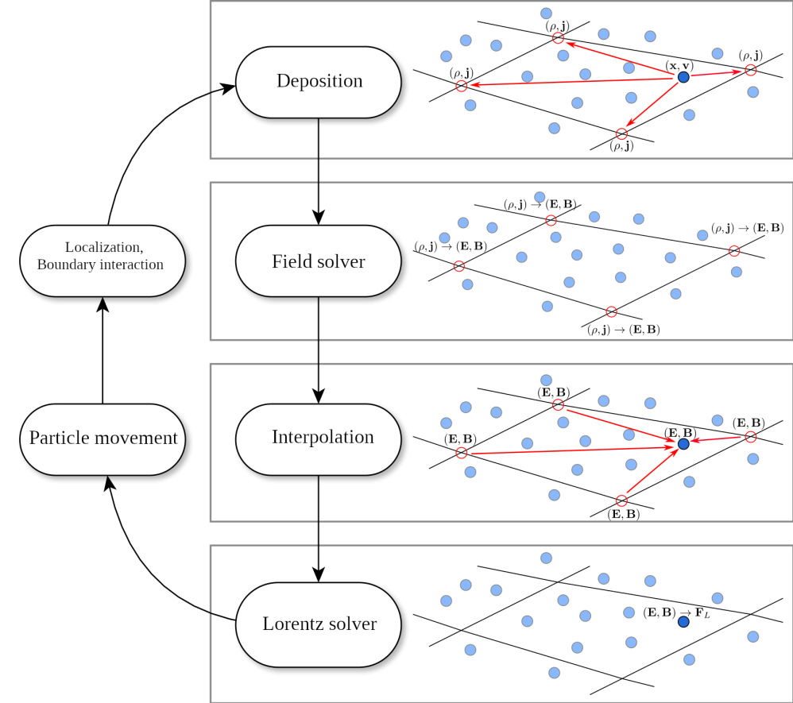

# Exploring Plasma Simulations Using the Particle in Cell Method in 1D and 2D

### Schematic Representation

Below is a conceptual schematic of the simulation setup (source: https://boltzplatz.eu/intro-particle-in-cell/):


# 1D Particle-in-Cell Simulation for Two-Stream Instability 

## Introduction

Welcome to the **1D Particle-in-Cell (PIC) Simulation for Two-Stream Instability** project! This project helps you understand how particles behave in a plasma—a state of matter similar to gas but with charged particles—using a computer simulation. Even if you've never coded before, this guide will walk you through what the simulation does, how it works, and how you can run it.

## What is Two-Stream Instability?

**Two-Stream Instability** happens when two groups of charged particles (like electrons) move in opposite directions through each other in one dimension. By looking at their phase space diagram we can see that any small disturbance cause a steep change in the gradient (ie the electric potential) which then snowballs into this instability effect neatly reflected in the phase space diagram. 

## What is a Particle-in-Cell (PIC) Simulation?

A **Particle-in-Cell (PIC)** simulation is a computer method used to study the behavior of charged particles in a plasma. It tracks the movement of individual particles and calculates the electric fields that influence them. This helps scientists and engineers understand complex plasma behaviors without needing to perform physical experiments.

## How Does the Simulation Work?

Here's a simple step-by-step explanation of how the simulation runs:

1. **Initialization**:
   - **Particles**: The simulation starts by placing a large number of particles randomly in a defined space.
   - **Velocities**: Half of the particles move to the right, and the other half move to the left.
   - **Perturbations**: Small changes are added to the particles' speeds to start the instability.

2. **Electric Field Calculation**:
   - The simulation calculates the electric fields created by the particles based on their positions.

3. **Movement**:
   - Using these electric fields, the simulation updates the positions and speeds of the particles.

4. **Visualization**:
   - The simulation creates visual pictures (plots) showing how the particles and electric fields change over time.

5. **Repeat**:
   - Steps 2 to 4 are repeated many times to simulate the behavior over a period.

## Getting Started

### What You Need

To run this simulation, you need:

- **Python**: A programming language. Download it from [python.org](https://www.python.org/downloads/).
- **Jupyter Notebook** (optional): A tool for running Python code interactively.
- **Python Libraries**:
  - `numpy`
  - `scipy`
  - `matplotlib`
  - `imageio`

### Installing Python and Libraries

1. **Install Python**:
   - Download and install Python from the [official website](https://www.python.org/downloads/).
   - Make sure to check the box that says "Add Python to PATH" during installation.

2. **Install Jupyter Notebook** (optional but recommended):
   - Open the Command Prompt (Windows) or Terminal (Mac/Linux).
   - Type the following command and press Enter:
     ```
     pip install notebook
     ```

3. **Install Required Libraries**:
   - In the Command Prompt or Terminal, type the following command and press Enter:
     ```
     pip install numpy scipy matplotlib imageio
     ```

### Downloading the Project

1. **Clone the Repository**:
   - If you have Git installed, open the Command Prompt or Terminal and type:
     ```
     git clone https://github.com/yourusername/PIC_Plasma_Simulator.git
     ```
   - Replace `yourusername` with your GitHub username.

2. **Or Download as ZIP**:
   - Go to the project repository on GitHub.
   - Click on the "Code" button and select "Download ZIP".
   - Extract the ZIP file to your desired location.

### Running the Simulation

1. **Open Jupyter Notebook** (if using):
   - Navigate to the project folder in the Command Prompt or Terminal.
   - Type:
     ```
     jupyter notebook
     ```
   - This will open Jupyter in your web browser.

2. **Open the Notebook File**:
   - In Jupyter, click on the notebook file (e.g. in this case, `PIC_Plasma_Simulator.ipynb`) to open it.

3. **Run the Simulation**:
   - Inside the notebook, run each cell one by one by clicking on it and pressing `Shift + Enter`.
   - The simulation will start and display visualizations.

4. **Save Visualizations**:
   - The simulation can save animations as GIFs for you to view later.

## Understanding the Simulation Parameters

You can change how the simulation behaves by adjusting these settings:

- **Number of Particles (`num_particles`)**: How many particles are in the simulation. More particles can make the simulation more accurate but slower.
- **Number of Mesh Cells (`num_mesh_cells`)**: Divides the space into smaller sections to calculate electric fields.
- **Simulation End Time (`simulation_end_time`)**: How long the simulation runs.
- **Timestep (`time_step`)**: The size of each step in time during the simulation.
- **Domain Size (`domain_size`)**: The size of the space where particles move.
- **Electron Density (`electron_density`)**: How many electrons are in a given space.
- **Beam Velocity (`beam_velocity`)**: The speed at which particles move.
- **Beam Width (`beam_width`)**: The range of particle speeds.
- **Perturbation Amplitude (`perturbation_amplitude`)**: How much initial variation is added to particle speeds to start the instability.

You can find these settings at the beginning of the simulation code. Feel free to change them and see what happens!

## Visualization Options

The simulation provides different ways to see what's happening:

- **Phase Space Diagram**: Shows particles' positions versus their speeds. It helps you see how particles spread out or cluster together.
- **Charge Density Plot**: Displays how many particles are in each section of the space. It shows areas with high and low particle concentrations.
- **Electric Field Plot**: Illustrates the strength and direction of electric forces in different parts of the space.

You can choose which visualization to view based on what you're interested in learning.

## Customizing the Simulation

If you want to try different scenarios, you can modify the simulation in several ways:

- **Change Integration Methods**:
  - **Leapfrog**: Good for long simulations.
  - **Runge-Kutta 4th Order**: More accurate but can be slower.
  
- **Select Different Perturbations**:
  - **Sinusoidal**: Adds a wave-like variation.
  - **Cosine**: Similar to sinusoidal with a different phase.
  - **Gaussian**: Adds a bell-curve-shaped variation.
  - **Random Noise**: Adds random variations.

- **Adjust Boundary Conditions**:
  - **Periodic**: Particles exiting one side enter from the opposite side.
  - **Sticky**: Particles stick to the boundaries.
  - **Reflective**: Particles bounce back when they hit the boundaries.

## Example Runs

### Example 1: Default Settings

Run the simulation with all default settings to see the basic two-stream instability.

```python
run_simulation_1d(
    method="leapfrog",
    perturbation_type="sinusoidal",
    save_gif=True,
    visualization_mode="Phase Space"
)

```

### Example 2: Checking out the Electric Field

Run the simulation to see the electric field over time instead of the phase space diagram and maybe use the gaussian perturbation function. 

```python
run_simulation_1d(
    method="leapfrog",
    perturbation_type="gaussian",
    save_gif=True,gif_name = "efield.gif"
    visualization_mode="Electric Field"
)

```

### Example 2: Checking out the Charge Density

Run the simulation to see the charge density over time instead of the phase space diagram and maybe use the random noise perturbation function. 

```python
run_simulation_1d(
    method="runge_kutta",
    perturbation_type="random_noise",
    save_gif=True,gif_name = "rho.gif"
    visualization_mode="Charge Density"
)

```


# 2D Particle-in-Cell Simulation for Two-Stream Instability

## Introduction

Welcome to the **2D Particle-In-Cell (PIC) Simulation**! This code is designed to simulate particle interactions and charge dynamics in a 2D grid using the Particle-In-Cell method. It includes features for initializing particles, injecting dense particle blocks, handling shocks, and visualizing charge density and particle dynamics.


## **Key Features**

### Particle Initialization
- **Random Initialization**: Distributes particles uniformly across the simulation domain.
- **Dense Block Injection**: Allows the injection of particles in a specific region with controlled velocity spreads.

### Simulation Methods
- **Leapfrog Integration**: Efficient method for updating particle positions and velocities.
- **Runge-Kutta Integration**: Higher-order integration for more accurate particle trajectory calculations.

### Boundary Conditions
- **Periodic**: Particles leaving one side of the domain re-enter on the opposite side.
- **Sticky**: Particles stick to boundaries upon contact.
- **Reflective**: Particles bounce back when hitting a boundary.

### Shock Simulation
- **Shock Front**: Models a moving shock front with particles reflecting upon contact.
- **Shock Block**: Applies a dense block of particles with size of your choosing and density of your choosing.

### Visualization
- Real-time density plots using a log scale to highlight regions of high and low charge density.
- Scatter plots for particle positions to observe their movement.

---

## **Code Functions Overview**

### Initialization
- `initialize_particles(num_particles, lx, ly)`: Sets up particle positions and velocities within the simulation domain.
- `inject_particles_block_with_spread(particles, block_params, num_dense_particles, mean_velocity, spread)`: Adds particles to a specific block with velocity spread.

### Shock Features
- `initialize_shock_particles()`: Creates shock particles.
- `update_shock_particles()`: Moves shock particles to simulate a traveling front.
- `apply_shock_reflection()`: Reflects particles interacting with the shock.
- `apply_shock_force()`: Applies forces on particles near the shock.

### Acceleration and Integration
- `calculate_acceleration()`: Computes particle acceleration due to electric fields.
- `leapfrog_step()`: Updates particle dynamics using the Leapfrog method.
- `runge_kutta_step()`: Updates particle dynamics using the Runge-Kutta method.

### Boundary Conditions
- `apply_periodic_boundary()`: Implements periodic boundaries.
- `apply_sticky_boundary()`: Prevents particles from leaving the domain.
- `apply_reflective_boundary()`: Reflects particles at boundaries.

### Visualization
- Interactive density and position plotting with Matplotlib.
- Option to save the simulation as an animated GIF.

---

## **How to Use**
1. **Set Parameters**: Adjust domain size, particle count, and simulation time steps in the `run_simulation_2d()` function. See the asteriked lines for more details about potential
   run options. Don't forget to run the command!
3. **Choose a Method**:
   - `"block"` for particle block injection.
   - `"front"` for shock simulation.
4. **Select Integration Method**:
   - `"leapfrog"` for faster but slightly less accurate integration.
   - `"runge_kutta"` for higher accuracy.
5. **Pick Boundary Type**:
   - `"periodic"`, `"sticky"`, or `"reflective"`.
6. **Run the Simulation**: Call the `run_simulation_2d()` function with the chosen options.

---

## **Example**


Run the simulation by injecting a dense block of particles and using the Leapfrog integrator.

```python
run_simulation_2d(
    method="block",
    integration_method="leapfrog",
    boundary_type="periodic",
    gif_name="block_injection_leapfrog_periodic.gif"
)
```
Run the simulation by injecting a shock front of particles and using the Runge Kutta integrator with sticky boundary conditions.
```python
run_simulation_2d(
    method="front",
    integration_method="runge_kutta",
    boundary_type="sticky",
    gif_name="front_injection_runge_kutta_sticky.gif"
)
```


